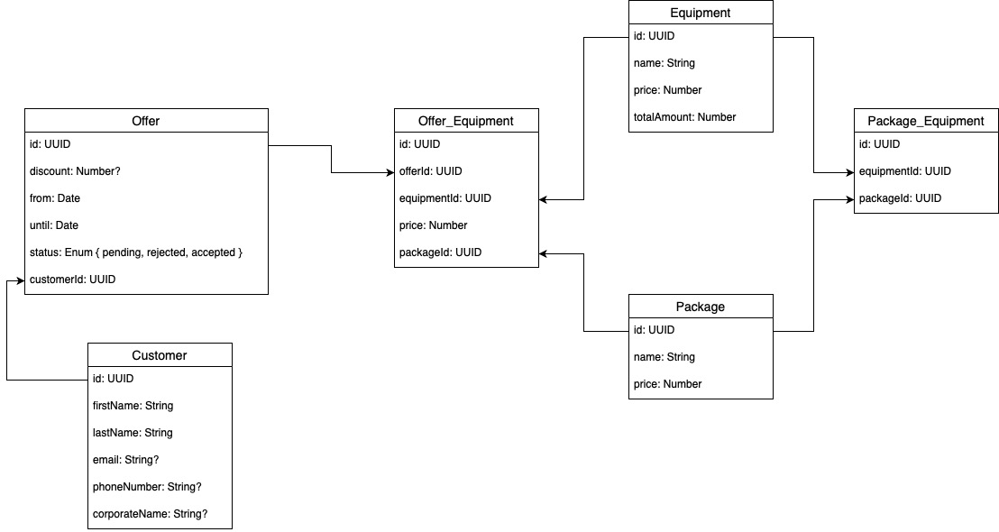

# api

## Description

Dreh Auf CMS GraphQL endpoint.

## Table Of Contents
- [Installation](#installation)
- [Running The App](#running-the-app)
    - [Development Secrets](#development-secrets)
    - [Testing](#testing)
- [Data Model](#data-model)

## Installation

```bash
$ npm install
```

## Running The App

```bash
# development
$ npm run start

# watch mode
$ npm run start:dev

# production mode
$ npm run start:prod
```

### Development Secrets

We use [dotenv](https://www.npmjs.com/package/dotenv) to keep secrets.

> ⚠️ The `.env` file containing the secrets is included in `.gitignore` and will not be tracked

You need to add the file to root and the following secrets yourself:
- `TYPEORM_CONNECTION`: type of database to use
- `TYPEORM_HOST`: database host adress
- `TYPEORM_PORT`: database port
- `TYPEORM_USERNAME`: username with database access rights
- `TYPEORM_PASSWORD`: password for username
- `TYPEORM_DATABASE`: database name
- `TYPEORM_SYNCHRONIZE`: enable synchronization of entites every time the app is run
- `TYPEORM_LOGGING`: enable logging
- `TYPEORM_ENTITIES`: the entity file locations

### Testing

```bash
# unit tests
$ npm run test

# unit tests on watch mode
$ npm run test:watch

# e2e tests
$ npm run test:e2e

# test coverage
$ npm run test:cov
```

## Data Model

<details><summary>Show file preview</summary>
    
</details>
<br>

The entity-relationship model is encoded in the file `erm.drawio`. To view and edit it, follow these steps:

1. Go to [DrawIO](https://app.diagrams.net/) and log in with Github
3. Click `File` → `Open from` → `GitHub...`
4. Choose `drehauf/api` → `erm.drawio`